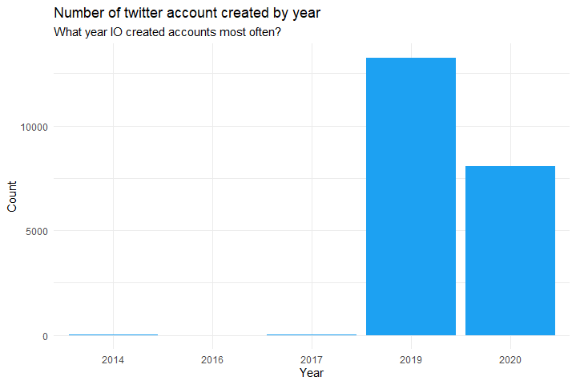

# simple-analysis-IOTweets-R
This project will show some simple visualization and simple analysis about IO twitter account in thailand.

## How many IO Twitter accounts are created each year

The number of IO twitter accounts was create in large numbers during the year 2019, when there is a significant political event in Thailand.

## What time of day does IO post on Twitter

As you can see from Histogram, Most tweeting times are operating hours from around 8:00 AM to 16:00 PM, meaning that IOs are active at the same time as normal working hours.

## Word cloud with hashtags

When counting the number of hashtags used by IO, it was found that the words most used were related to the military and to the Future Forward Party.

## Word cloud with hashtags (Delete some hashtags about military)

Removing some military hashtags, you will see more other hashtags.
